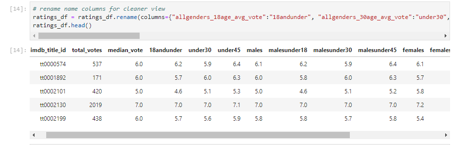

# Project Proposal

For this project, we will be using various models to determine the best method for predicting the IMDB rating of a movie based on historical data. In order to conduct this predictive modeling endeavor, we sourced our data from [Kaggle.com](https://www.kaggle.com/stefanoleone992/imdb-extensive-dataset) which featured a set of csv files with information regarding movies rated by IMDB users dating back from 1906 to 2019. 

From this dataset we will use the movies and ratings csv files. The movies csv contains attributes of movies rated by IMDB users such as genre, year released, notable actors, budget and director. The ratings csv contains the overall rating of each movie title as well as the median ratungs and ratings broken down by users' gender and age group. We will use SQL to manage and export our database into a workable file.

 

Our deliverable for the client will be a web site (HTML/CSS/Bootstrap) that features the four machine learning models we will use to predict IMDB movie ratings based of movie attributes and analysis on how well the models work for our data. 

We plan to use the following models:

             1. Linear Regression
             2. Logistic Regression
             3. Service Vector Machine
             4. Deep Learning

We will also provide visualizations (Javascript Plotly/D3 and Tableau) exploring any attributes that seem to strongly affect our models and analysis on why we believe any relationships may exist.
  
