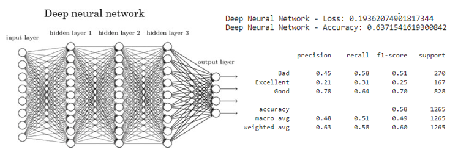
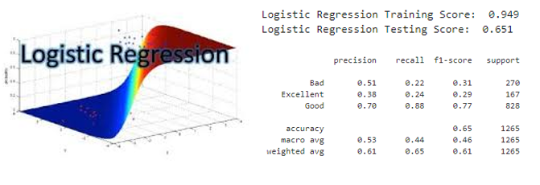

# Final Project for 2020 Georgia Tech Data Analytics Bootcamp

Have you ever watched a movie and ended up disappointed with the outcome? Our project focused on designing models to predict IMDB movie ratings based on genre, year of release, budget, duration, and director.

## Objective

For this project, we used various models to determine the best method for predicting the IMDB rating of a movie based on historical data. In order to conduct this predictive modeling endeavor, we sourced our data from [Kaggle.com](https://www.kaggle.com/stefanoleone992/imdb-extensive-dataset/) which featured a set of csv files with information regarding movies rated by IMDB users dating back from 1906 to 2019.

Link to Dataset: https://www.kaggle.com/stefanoleone992/imdb-extensive-dataset/

Prototype/Inspirations: https://netflix.com

Heroku app: https://clarke-imdb.herokuapp.com/

### Methods Used
* Data Cleaning
* Data Visualization

### Technologies
* Python
* Pandas
* Jupyter
* Javascript
* D3
* HTML
* CSS
* Machine Learning Models: 
  - Support Vector Model
  - Deep Learning
  - Logistic Regression 
  - Random Forest
* DataTables
* Flask
* PostgreSQL

## Project Description

## Tableau Visualizations
### Year Dashboard

### Genre Dashboard

### Director Dashboard

The directors we have shown are the more popular directors with the most votes and data.

## Machine Learning Model

### Deep Learning

### Support Vector Model (SVM)

### Logistic Regression

### Random Forest
