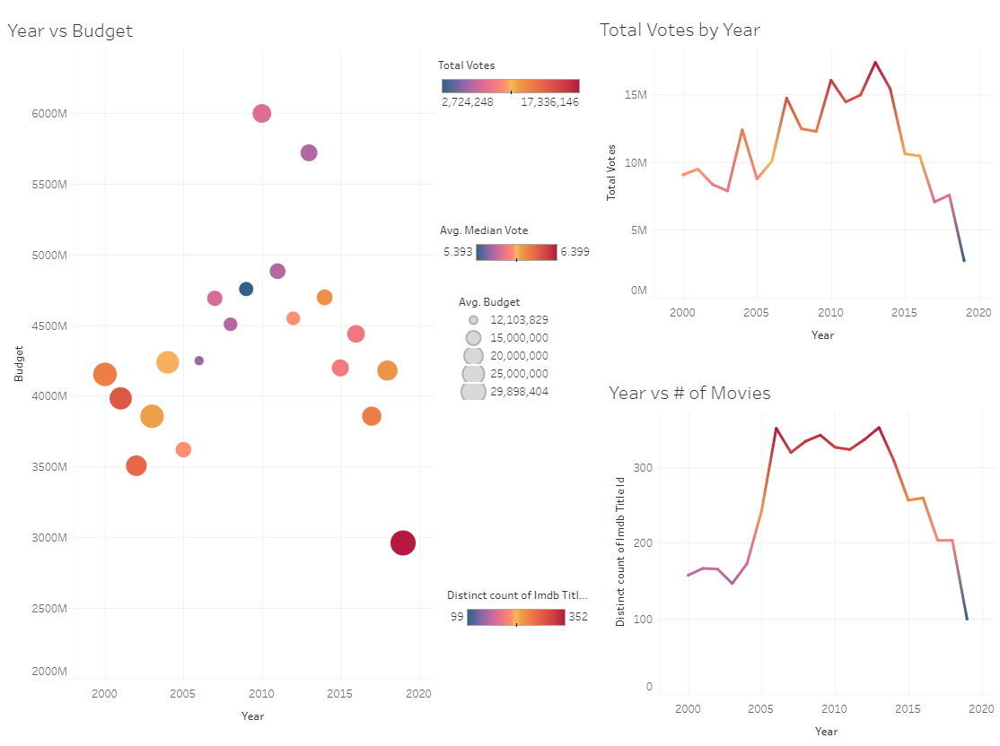
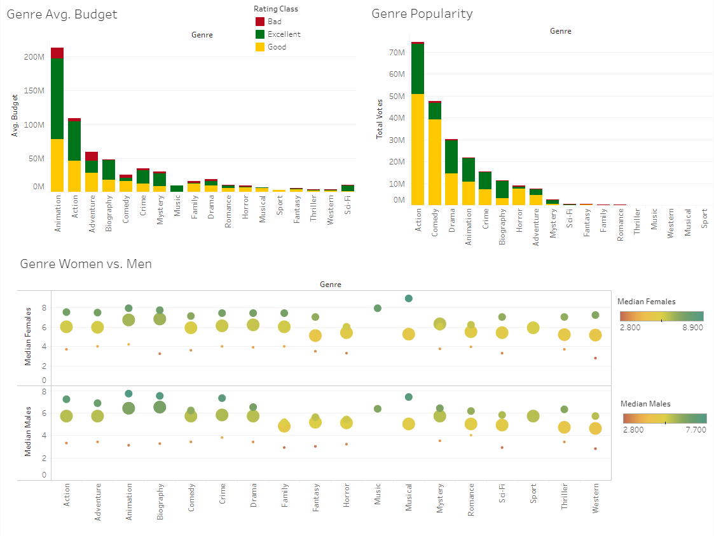
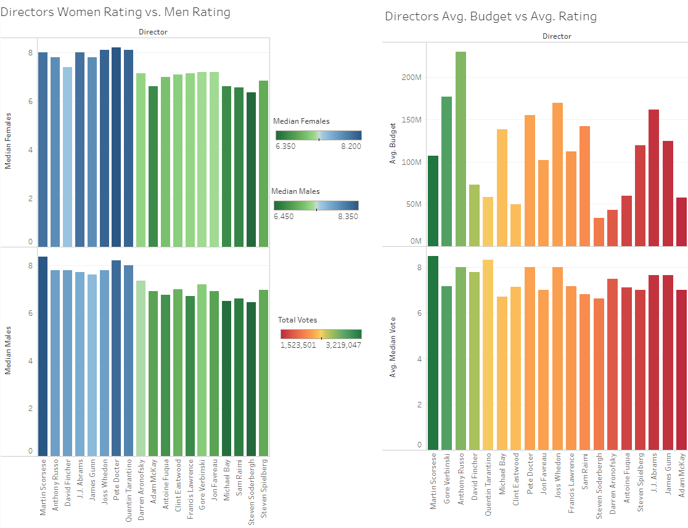

# Final Project for 2020 Georgia Tech Data Analytics Bootcamp

Have you ever watched a movie and ended up disappointed with the outcome? Our project focused on designing models to predict IMDB movie ratings based on genre, year of release, budget, duration, and director.

## Objective

For this project, we used various models to determine the best method for predicting the IMDB rating of a movie based on historical data. In order to conduct this predictive modeling endeavor, we sourced our data from [Kaggle.com](https://www.kaggle.com/stefanoleone992/imdb-extensive-dataset/) which featured a set of csv files with information regarding movies rated by IMDB users dating back from 1906 to 2019.

Link to Dataset: https://www.kaggle.com/stefanoleone992/imdb-extensive-dataset/

Prototype/Inspirations: https://netflix.com

Heroku app: https://clarke-imdb.herokuapp.com/

### Methods Used
* Data Cleaning
* Data Visualization

### Technologies
* Python
* Pandas
* Jupyter
* Javascript
* D3
* HTML
* CSS
* Machine Learning Models: 
  - Support Vector Model
  - Deep Learning
  - Logistic Regression 
  - Random Forest
* DataTables
* Flask
* PostgreSQL

## Project Description
### Site Design

### Data Cleaning

## Tableau Visualizations
### Release Year Dashboard

### Genre Dashboard

### Director Dashboard

The directors we have shown are the more popular directors with the most votes and data. We used directors as one of our elements for the prediction models as well. Here we are showing the director data comparison of gender vs rating and budget vs rating.

## Machine Learning Model

Given the analysis that we did in Tableau, we decided to predict the movie’s rating class based on release year, duration, budget, genre, and director. We started with a linear regression model and elasticnet, but the accuracy was around 10%. So we figured that no amount of hyper-parameter tuning would get us much higher than that. For some models we tried only using the numerical features (year, duration, and budget) but the results were not better so we decided to move forward with both numerical and categorical data.

### Deep Learning

### Support Vector Model (SVM)

For the SVM we cleaned the data with label and dummy encoder to get a better accuracy for our target rating class for bad excellent and good. We have the SVM training accuracy at 0.91% and SVM testing accuracy at 0.64%. 

### Logistic Regression

### Random Forest

